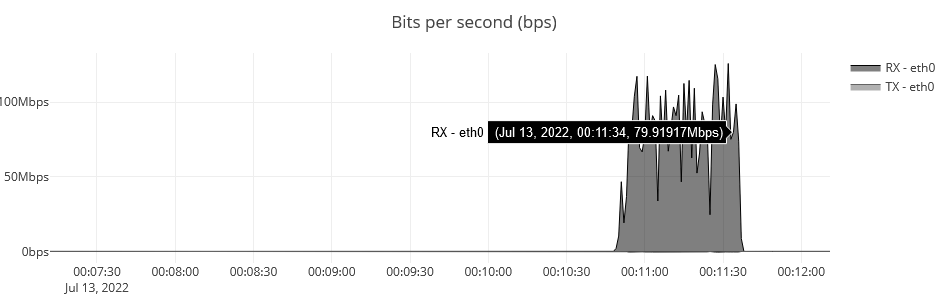
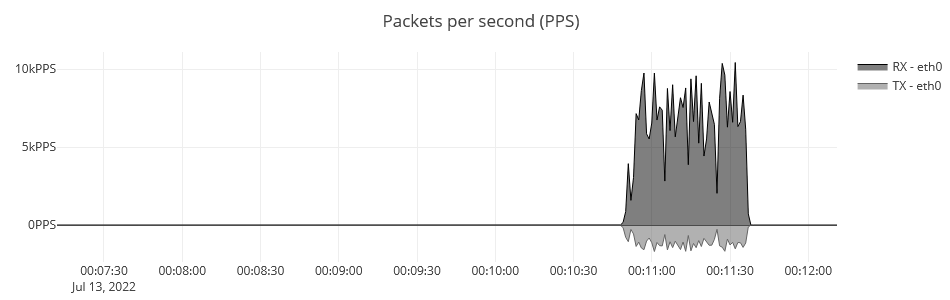
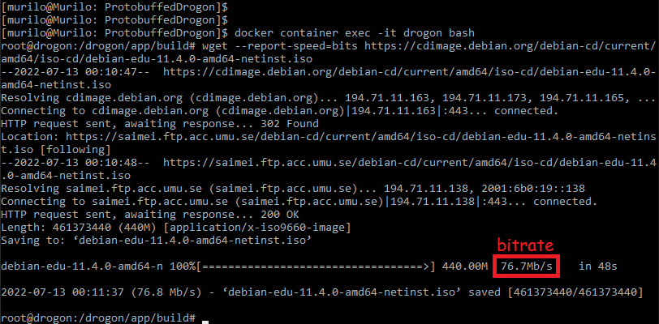
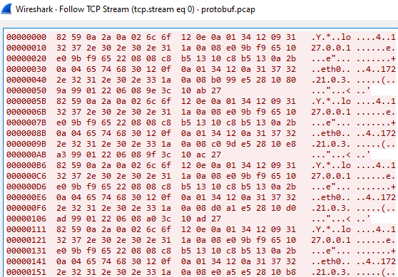

<h1 align="center"> ProtobuffedDrogon </h1>

> A simple implementation of protobuf in drogon framework. 

- Also, you can write by opening an Issue and also solve a current issue if possible.
- Fork this project to your Github account.
- This software is created under [MIT License](https://github.com/MuriloChianfa/ProtobuffedDrogon/blob/main/LICENSE)

<hr>

## Running the project

- Download docker images or build them: 
```bash
docker-compose pull || docker-compose build
```

- Run environment
```bash
docker-compose up -d
```

- Access website to connect with drogon websocket: http://127.0.0.1/
- You'll receive traffic updates from your interfaces every 1 second (bps and pps).

## Testing example:

Downloading Debian 11 iso image with wget.

> Use --report-speed=bits to gets the bitrate metrics





## Protobuf packets sented throught websocket to website:

> The minimal throuput as possible.


